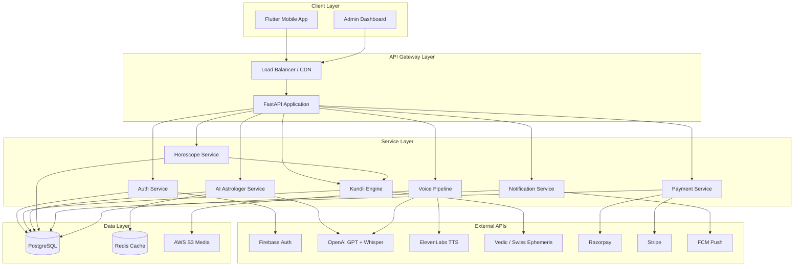
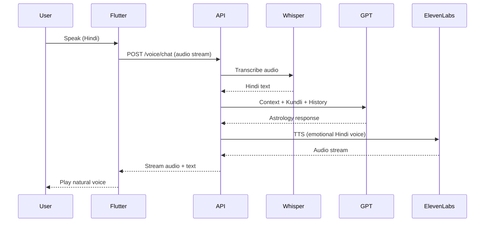

# AI Jyotish Guru - System Architecture

## High-Level Architecture



## Voice Chat Pipeline



## Scalability Design (1M+ Users)

| Component | Strategy |
|-----------|----------|
| API | Horizontal scaling (K8s/ECS), 4+ workers per instance |
| Database | Read replicas, connection pooling (asyncpg), indexed queries |
| Redis | Session cache, rate limits, hot horoscope cache |
| Voice | Async job queue for long TTS, WebSocket streaming |
| Media | S3 + CloudFront CDN |
| AI | Request batching, token limits, conversation summarization |

## Security Layers

1. **Firebase ID Token** verification on mobile login
2. **JWT** access/refresh tokens for API sessions
3. **Fernet encryption** for sensitive birth data at rest
4. **HTTPS** everywhere in production
5. **Rate limiting** per user/IP (Redis)
6. **Webhook signature** verification (Razorpay/Stripe)
7. **GDPR**: data export, account deletion endpoints

## Module Boundaries

```
backend/app/
├── api/v1/          # HTTP routes only
├── services/        # Business logic
├── models/          # SQLAlchemy ORM
├── schemas/         # Pydantic DTOs
├── core/            # Config, security, DB
└── integrations/    # External API clients
```

## Mobile Architecture (Flutter)

Clean Architecture + Feature modules:

```
lib/
├── core/           # Theme, router, DI, network
├── features/       # auth, kundli, voice, horoscope, profile, subscription
└── shared/         # Widgets, models, utils
```

State management: **Riverpod**  
Routing: **go_router**  
Networking: **Dio** + interceptors
