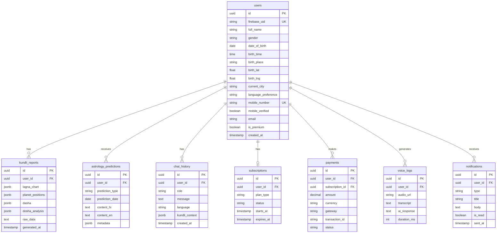

# Database Design

## ER Diagram

## Indexes (Performance)

- `users(firebase_uid)`, `users(mobile_number)`
- `kundli_reports(user_id, generated_at DESC)`
- `chat_history(user_id, created_at DESC)`
- `astrology_predictions(user_id, prediction_type, prediction_date)`
- `subscriptions(user_id, status)`
- `notifications(user_id, is_read, sent_at DESC)`

## Partitioning (Scale)

For 1M+ users, consider:
- `chat_history` partitioned by month
- `voice_logs` archived to cold storage after 90 days
- `astrology_predictions` TTL cache in Redis
